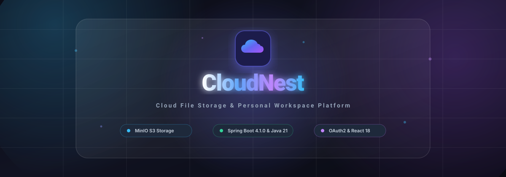
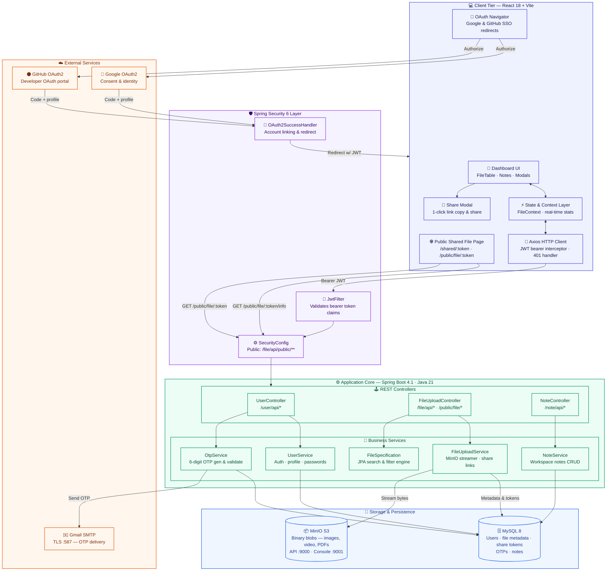

# ☁️ CloudNest - Cloud File Storage Platform

<div align="center">



[](https://spring.io/projects/spring-boot)
[](https://www.oracle.com/java/)
[](https://react.dev/)
[](https://vitejs.dev/)
[](https://min.io/)
[](https://www.mysql.com/)
[](https://oauth.net/2/)
[](https://www.docker.com/)

**CloudNest** is a modern, enterprise-ready cloud file storage and personal workspace platform built with **Spring Boot 4.1.0 (Java 21)**, **MinIO (S3-Compatible Object Storage)**, **MySQL 8**, and **React 18 (Vite)**. It provides secure file storage, multi-factor OTP verification, JWT authorization, OAuth2 social login (Google & GitHub), real-time capacity metrics, and workspace notes management.

</div>

---

## 📑 Table of Contents

- [✨ Key Features](#-key-features)
- [🏛️ System Architecture Diagram](#️-system-architecture-diagram)
- [📁 Project Folder Structure](#-project-folder-structure)
- [🛠️ Tech Stack & Tools](#️-tech-stack--tools)
- [⚙️ Prerequisites](#️-prerequisites)
- [🚀 Step-by-Step Setup Guide](#-step-by-step-setup-guide)
  - [1. Clone Repository](#1-clone-repository)
  - [2. Start MinIO S3 with Docker Compose](#2-start-minio-s3-with-docker-compose)
  - [3. Configure MySQL Database](#3-configure-mysql-database)
  - [4. Set Up Google & GitHub OAuth2 Credentials](#4-set-up-google--github-oauth2-credentials)
  - [5. Run Spring Boot Backend](#5-run-spring-boot-backend)
  - [6. Run React Frontend](#6-run-react-frontend)
- [📡 REST API Reference](#-rest-api-reference)
- [🔒 Security & Authentication Flow](#-security--authentication-flow)
- [🤝 Contributing](#-contributing)
- [📄 License](#-license)

---

## ✨ Key Features

- **High-Performance Object Storage (MinIO / S3)**: Ultra-fast binary file storage supporting uploads, chunked streaming, file downloads, and permanent deletion.
- **Enterprise-Grade Authentication**:
  - Email/password signup protected with 6-digit email OTP verification.
  - JWT Bearer Token authorization with automatic Axios request interceptors.
  - OAuth2 Single Sign-On (SSO) with **Google** and **GitHub**.
  - Password reset with email OTP validation.
- **Dynamic File Explorer**:
  - Server-side 20-record pagination.
  - Case-insensitive search using **Spring Data JPA Specifications** with 350ms debouncing.
  - Multi-type category filtering (`Images`, `Videos`, `Documents`, `Others`).
  - Dynamic sorting by upload date, name (A-Z / Z-A), and file size.
- **Smart Trash & Archive Lifecycle**:
  - Soft-delete files to Trash with 30-day retention indicator.
  - Archive files to declutter active workspaces.
  - Real-time instant count, quota, and badge updates without requiring page refreshes.
- **Personal Workspace & Notes**:
  - Rich workspace notes categorized by Work, Personal, Ideas, and Important.
- **Live Cloud Quota Analytics**:
  - Real-time 5 GB capacity calculation with progress bars and storage distribution stats.

---

## 🏛️ System Architecture Diagram



---

## 📁 Project Folder Structure

```text
CloudNest/
├── docker-compose.yml              # MinIO S3 Object Storage Docker Container Setup
├── pom.xml                         # Spring Boot 4.1.0 & Java 21 Maven Configuration
├── README.md                       # Comprehensive Project Documentation
├── src/
│   ├── main/
│   │   ├── java/com/cloud/CloudNest/
│   │   │   ├── config/             # AppConfig, MinioConfig, SecurityConfig, WebConfig
│   │   │   ├── controller/         # FileUploadController, NoteController, UserController
│   │   │   ├── dto/                # UserDto, NoteDto, FileMetaDataDto, CategoryStatsDto
│   │   │   │   ├── request/        # LoginRequest, SendOtpRequest, VerifyOtpRequest, etc.
│   │   │   │   └── response/       # AuthResponse, OtpResponse, PaginatedFileResponse
│   │   │   ├── entities/           # UserData, FileMetaData, Note, EmailOtp
│   │   │   ├── repository/         # JPA Repositories (UserData, FileMetaData, Note, etc.)
│   │   │   ├── security/           # JwtFilter, Oauth2SuccessHandler, UserPrincipal
│   │   │   ├── services/           # Business Logic Interfaces & Implementations
│   │   │   ├── specification/      # FileSpecification (JPA Specification for Search/Filter)
│   │   │   └── util/               # JwtUtil (Token generation & claim extraction)
│   │   └── resources/
│   │       └── application.properties  # Database, MinIO, SMTP, and OAuth2 Config
│   └── test/                       # Unit & Integration Tests
│
└── frontend/                       # React 18 + Vite Single Page Application
    ├── .env                        # Central Backend URL Environment Configuration
    ├── package.json                # Frontend NPM Dependencies & Scripts
    ├── tailwind.config.js          # Tailwind CSS Configuration
    ├── vite.config.js              # Vite Build Configuration
    └── src/
        ├── components/             # FileTable, FileCard, StorageCard, Sidebar, Header, etc.
        ├── context/                # FileContext (Global state for files, user, stats, modals)
        ├── pages/                  # Dashboard, Files, Notes, Archive, Trash, Login, Signup, OAuthCallback
        ├── services/               # api.js (Axios HTTP Client with JWT Interceptors)
        ├── styles/                 # index.css (Glassmorphism & dark theme design system)
        ├── App.jsx                 # Routing & ProtectedRoute setup
        └── main.jsx                # Application Entrypoint
```

---

## 🛠️ Tech Stack & Tools

### Backend
- **Language**: Java 21
- **Framework**: Spring Boot 4.1.0
- **Security**: Spring Security 6, OAuth2 Client, JJWT (JSON Web Token)
- **Persistence**: Spring Data JPA, Hibernate, MySQL 8
- **Object Storage**: MinIO Java SDK (Amazon S3 Compatible API)
- **Mailing**: Spring Boot Starter Mail (JavaMailSender SMTP)
- **Utilities**: Project Lombok, Jackson ObjectMapper

### Frontend
- **Framework**: React 18.x with Vite
- **Routing**: React Router DOM v6
- **Styling**: Tailwind CSS & Custom Glassmorphic Dark Design System
- **Icons**: Lucide React
- **HTTP Client**: Axios with global JWT Request & 401 Response Interceptors

### Infrastructure & DevOps
- **Docker & Docker Compose**: Automated containerization for MinIO S3 storage
- **MinIO Console**: Web-based administration panel on `http://localhost:9001`

---

## ⚙️ Prerequisites

Before running the project, make sure you have the following installed on your machine:

1. **Java Development Kit (JDK 21 or higher)**
   ```bash
   java -version
   ```
2. **Node.js (v18.x or higher) & npm**
   ```bash
   node -v
   npm -v
   ```
3. **Docker & Docker Compose**
   ```bash
   docker --version
   docker compose version
   ```
4. **MySQL Database Server (v8.x)** (or run via Docker)

---

## 🚀 Step-by-Step Setup Guide

### 1. Clone Repository

```bash
git clone https://github.com/kartik-lohate11/CloudNest-Cloud-File-Storage-Platform.git
cd CloudNest
```

---

### 2. Start MinIO S3 with Docker Compose

CloudNest uses **MinIO** as an on-premise, ultra-fast S3-compatible object storage service.

To start MinIO:
```bash
docker compose up -d
```

- **S3 API Endpoint**: `http://localhost:9000`
- **MinIO Web Console**: `http://localhost:9001`
- **Username**: `admin`
- **Password**: `admin12345`

> **Note**: CloudNest automatically verifies and creates the `cloudnest` bucket upon startup if it does not already exist.

---

### 3. Configure MySQL Database

1. Open your MySQL client or terminal and create the `cloudnest` database:
   ```sql
   CREATE DATABASE IF NOT EXISTS cloudnest;
   ```
2. Open `src/main/resources/application.properties` and verify your credentials:
   ```properties
   # Database Configuration
   spring.datasource.url=jdbc:mysql://localhost:3306/cloudnest
   spring.datasource.username=root
   spring.datasource.password=your_mysql_password
   spring.datasource.driver-class-name=com.mysql.cj.jdbc.Driver

   spring.jpa.hibernate.ddl-auto=update
   spring.jpa.show-sql=true

   # MinIO (S3) Configuration
   minio.url=http://localhost:9000
   minio.access-key=admin
   minio.secret-key=admin12345
   minio.bucket=cloudnest

   # SMTP Email Configuration (For OTP)
   spring.mail.host=smtp.gmail.com
   spring.mail.port=587
   spring.mail.username=your_email@gmail.com
   spring.mail.password=your_app_password
   ```

---

### 4. Set Up Google & GitHub OAuth2 Credentials

#### A. Google OAuth2 Setup:
1. Go to the [Google Cloud Console](https://console.cloud.google.com/).
2. Create a new project and configure the **OAuth consent screen**.
3. Navigate to **Credentials** > **Create Credentials** > **OAuth client ID**.
4. Application type: **Web application**.
5. Add **Authorized redirect URIs**:
   ```text
   http://localhost:8080/login/oauth2/code/google
   ```
6. Copy your **Client ID** and **Client Secret** into `application.properties`:
   ```properties
   spring.security.oauth2.client.registration.google.client-id=YOUR_GOOGLE_CLIENT_ID
   spring.security.oauth2.client.registration.google.client-secret=YOUR_GOOGLE_CLIENT_SECRET
   ```

#### B. GitHub OAuth2 Setup:
1. Go to **GitHub Settings** > **Developer settings** > **OAuth Apps** > **New OAuth App**.
2. **Homepage URL**: `http://localhost:5173`
3. **Authorization callback URL**:
   ```text
   http://localhost:8080/login/oauth2/code/github
   ```
4. Copy your **Client ID** and **Client Secret** into `application.properties`:
   ```properties
   spring.security.oauth2.client.registration.github.client-id=YOUR_GITHUB_CLIENT_ID
   spring.security.oauth2.client.registration.github.client-secret=YOUR_GITHUB_CLIENT_SECRET
   ```

---

### 5. Run Spring Boot Backend

You can run the backend using the Maven wrapper:

```bash
# Windows
./mvnw.cmd spring-boot:run

# Linux / macOS
./mvnw spring-boot:run
```

The Spring Boot backend will start on **`http://localhost:8080`**.

---

### 6. Run React Frontend

1. Navigate to the `frontend` directory:
   ```bash
   cd frontend
   ```
2. Verify the `.env` file contains:
   ```env
   VITE_BACKEND_URL=http://localhost:8080
   ```
3. Install dependencies:
   ```bash
   npm install
   ```
4. Start the Vite development server:
   ```bash
   npm run dev
   ```
5. Open your browser and navigate to:
   ```text
   http://localhost:5173
   ```

---

## 📡 REST API Reference

### 🔐 User & Authentication APIs (`/user/api`)

| Method | Endpoint | Description | Auth Required |
| :--- | :--- | :--- | :--- |
| `POST` | `/user/api/login` | Authenticate with username/password & receive JWT token | No |
| `POST` | `/user/api/create` | Register new user account | No |
| `POST` | `/user/api/send-otp` | Send 6-digit OTP to user email (`REGISTRATION` / `FORGOT_PASSWORD`) | No |
| `POST` | `/user/api/verify-otp` | Validate OTP code | No |
| `POST` | `/user/api/update-password` | Reset password using verified email | No |
| `GET` | `/user/api/me` | Fetch authenticated user profile | **Yes (Bearer JWT)** |

### 📂 File Management APIs (`/file/api`)

| Method | Endpoint | Description | Auth Required |
| :--- | :--- | :--- | :--- |
| `POST` | `/file/api/upload/{userName}` | Upload file to MinIO S3 & persist metadata | **Yes** |
| `GET` | `/file/api/get-files/{userName}` | Get paginated files (20 per page) | **Yes** |
| `GET` | `/file/api/search/{userName}` | Search files across all database records with JPA Specifications | **Yes** |
| `GET` | `/file/api/filter/{userName}` | Filter files by type (`image`, `video`, `document`, `other`) | **Yes** |
| `GET` | `/file/api/sort/{userName}` | Dynamic sorting (`date-desc`, `date-asc`, `name-asc`, `size-desc`) | **Yes** |
| `GET` | `/file/api/download/{objectName}` | Download file stream directly from MinIO | **Yes** |
| `DELETE` | `/file/api/delete/{objectName}` | Permanently delete file from MinIO & MySQL | **Yes** |

### 📝 Notes APIs (`/note/api`)

| Method | Endpoint | Description | Auth Required |
| :--- | :--- | :--- | :--- |
| `POST` | `/note/api/save/{userName}` | Save a new note | **Yes** |
| `GET` | `/note/api/get-all/{userName}` | Retrieve paginated notes | **Yes** |
| `PUT` | `/note/api/update/{id}/{userName}` | Update note title, content, or category | **Yes** |
| `DELETE` | `/note/api/delete/{id}` | Delete note | **Yes** |

---

## 🔒 Security & Authentication Flow

1. **JWT Header Attachment**:
   Axios automatically includes `Authorization: Bearer <token>` for all outgoing HTTP requests using request interceptors.
2. **OAuth2 Callback Flow**:
   - User clicks **Google** or **GitHub** login button -> Browser navigates to `/oauth2/authorization/<provider>`.
   - Backend processes OAuth profile, generates JWT token, and redirects to `http://localhost:5173/oauth/callback?token=JWT_TOKEN`.
   - The React `OAuthCallback` component extracts the token, stores it in `localStorage`, strips the token parameter from the browser URL, and renders the Dashboard (`/`).
3. **Session Expiry Handling**:
   A global Axios response interceptor catches HTTP `401 Unauthorized` responses, clears local storage, and redirects the user safely to the `/login` route.

---

## 🤝 Contributing

Contributions, issues, and feature requests are welcome!

1. Fork the Project
2. Create your Feature Branch (`git checkout -b feature/AmazingFeature`)
3. Commit your Changes (`git commit -m 'Add some AmazingFeature'`)
4. Push to the Branch (`git push origin feature/AmazingFeature`)
5. Open a Pull Request

---

## 📄 License

This project is licensed under the MIT License - see the [LICENSE](LICENSE) file for details.

<div align="center">
  <sub>Built with ❤️ by <a href="https://github.com/kartik-lohate11">Kartik Lohate</a></sub>
</div>
